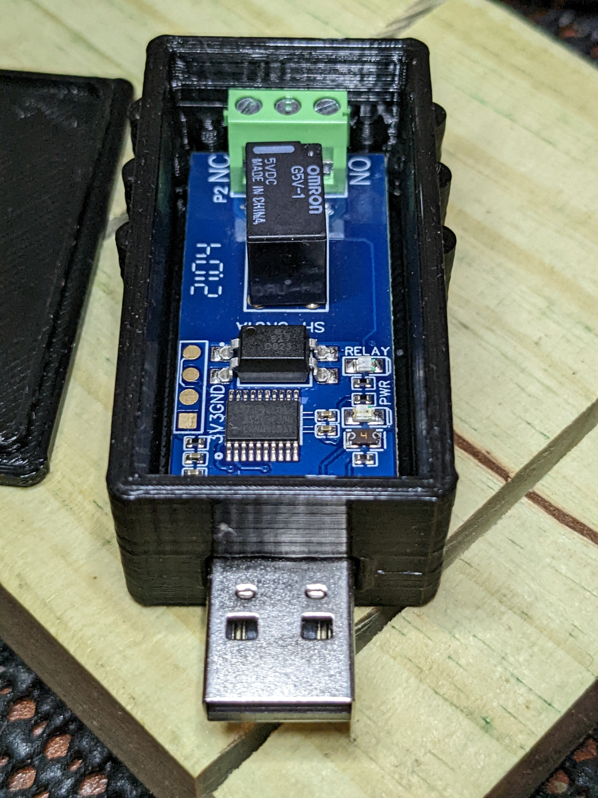

# USB Relay Enclosure for<br>DSD Tech SH-UR01A

## Overview

The "DSD TECH  USB Relay Controller for Computer and Laptop (1CH)" lets you control a single SPDT relay via USB. I purchased my device on [Amazon](https://smile.amazon.com/dp/B09PYML6Q7). It comes (mostly) enclosed in a transparent blue case with the relay and screw terminals exposed, along with the back half of the board. The client preferred that the internals not be so accessible.

There are a number of similar designs without cases which probably use the the same board size. If the board size is different, just modify board_x, board_y, and board_height in SCAD/DSD-Encl-common.scad in OpenSCAD and render DSD-Encl-base.scad and save the STL file (Windows F5, F6, F7).

## Status

|    Date    | Status         |
| :--------: | -------------- |
| 2022-11-20 | Done.          |
| 2022-11-18 | First release. |

## ToDo List

* -none-

## Board Extraction

The case is a clamshell design that separates with the patient use of a spudger or pen knife. There are (6) small acrylic pins that hold the halves together. The board is well supported and positioned within the case.

## The Enclosure via OpenSCAD

My enclosure was developed using OpenSCAD, a programming language that is used to render 3-D objects for visualization and export to a standard STL file, which can then be used for 3-D printing. Elements are defined parametrically so they can be modified easily and immediately visualized and printed.

My OpenSCAD code uses some Booleans that can help visualize the package.

```
SHOW_BOARD = false;    // false before exporting STL!
HIDE_SHELL = false;    // for visualizing internals
```

SHOW_BOARD shows the printed circuit board and some components. HIDE_SHELL hides the shell mostly so you can see the internal structures. OpenSCAD has a transparent feature but it doesn't seem to work well with the rounded corners.

I uses color() to highlight areas of interest. There's a final color("MediumSpringGreen") (~line 31) that applies to the entire object. This needs to be commented out to see the component colors.

I added a hz_pins_2() function to just print pins on the left (terminal block) side and left the original hz_pins() function in place.

## Files

There are two files sets that I provide:

* Enclosure Files:
  * (3) .scad files for the bottom shell, lid, and common dimensions.
* Library files with routines for unit conversions and generating circuit board images.

### External Resources

OpenSCAD tool: [OpenSCAD.org](https://openscad.org/)

The Belfry OpenSCAD Library [revarbat/BOSL](revarbat/BOSL).

Place the BOSL and mylibs dirs in your OpenSCAD libraries directory (e.g., Documents/OpenSCAD/libraries/).

### Photo



## Fitment

The DSD board snaps snuggly into place once the USB plug end is carefully inserted through the USB window opposite of the ribbed end. Then just press down and everything should snap gently into place. There is a cable port opposite the USB window that allows you to insert wires into the NO, COM, and NC ports such that you can secure them with the terminal screws from above.

It may help to shorten the leads of the wire terminal connector with a pair of "nippy" or flush cutter pliers so that they don't catch on the edge of the enclosure, but new lower case and larger USB window has resolved the issue for me.

The lid simply snaps on.

## Operation

Relay terminals operate thusly:

* The **COM** (common) terminal is always connected to one (and only) of the other terminals at any given time.
* The **NC** (normally connected) terminal connects to the COM terminal whenever the relay **IS NOT** energized, and is isolated otherwise.
* The **NO** (normally open) terminal is normally isolated but connects to the COM terminal when the relay **IS** energized.

You would normally use the COM and NO terminals to simulate a switch. The contacts are not polarized so connect either contact (tip or ring if using 1/8"/3.5mm plugs).

For software operation please refer to vendor's documentation.

## Wire Connection Terminal

The three terminal wire connector appears to be a TE Connectivity/AMP #[1546551-3](https://www.digikey.com/short/0d5nwh74). 3-terminal 0.138"/3.5mm pitch, 120A 300V suitable for #16-28AWG wire ... or a clone. The screws are vertical so they can be manipulated with the lid removed.

The solder holes are not very big - TE recommends 1.1mm PCB holes for the connector's solder pins - just barely larger than #18AWG. I'll get a measurement on the solder holes soon.

## 1/8"/3.5mm Mono (TS) Cables

TS cables use the tip and sleeve contacts of a monophonic 1/8"/3.5mm "headphone" plug. A stereo plug is a "TRS" plug. TRS stands for Tip, Ring, & Sleeve since there is a third center contact giving you Left, Right and Ground. If you use a stereo (TRS) plug with a mono (TS) jack you'll have to verify whether the mono sleeve contact connects with the stereo sleeve (most common) or ring contact.

Here's a Digi-Key [search]() of 1/8" jacks terminated in a "pigtail", stripped wires. Length from 1 to 10'. Mono cables and jacks are scarce here - just be consistent if you use TRS hardware, or verify the mapping between TS and TRS hardware.

Amazon may offer a better selection - like this [one](https://smile.amazon.com/Fancasee-Replacement-Female-Connector-Repair/dp/B07Y8KR21P).

