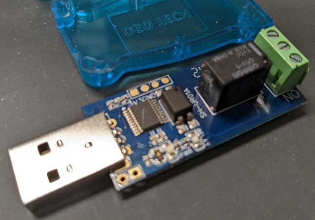

# DSD Original Enclosure

## Images

### Complete

Here's the DSD device with the case separated slightly. You can see that the relay, terminal block, and about half of the board are exposed.

Here you can see the pins that hold the case together.

The top half of the case has been removed. It sits nicely supported and constrained in the base.

Here's the board with the case removed.

And finally the bottom of the board. You can see labelling of the terminals and that there's no interference for board supports at the corners. I don't know what the empty solder terminals connect to.

